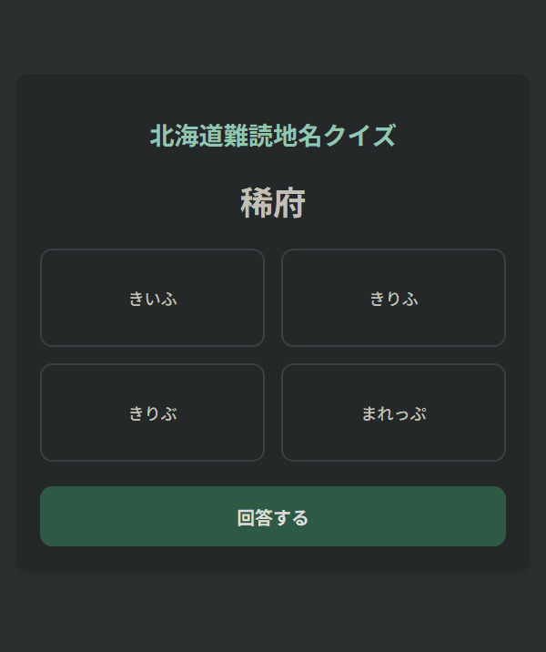
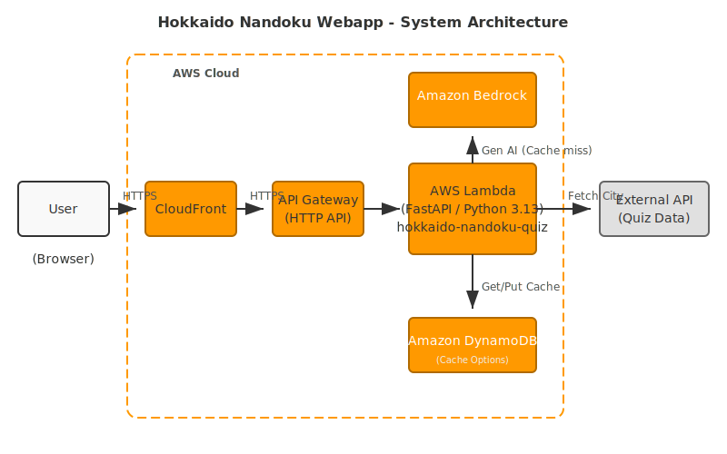

# 北海道難読地名クイズ Web アプリケーション

北海道の難読地名の読み方を当てるクイズ Web アプリです。

## 概要

ランダムに選ばれた北海道の難読地名と 4 つの読み方の選択肢が表示されます。回答を選択すると、正解・不正解が即座に表示され、次の問題に進むことができます。

バックエンド API として [hokkaido-nandoku-api](https://github.com/tsubasaogawa/hokkaido-nandoku-api) を利用しています。

## 開発

[DEVELOPMENT.md](DEVELOPMENT.md)
