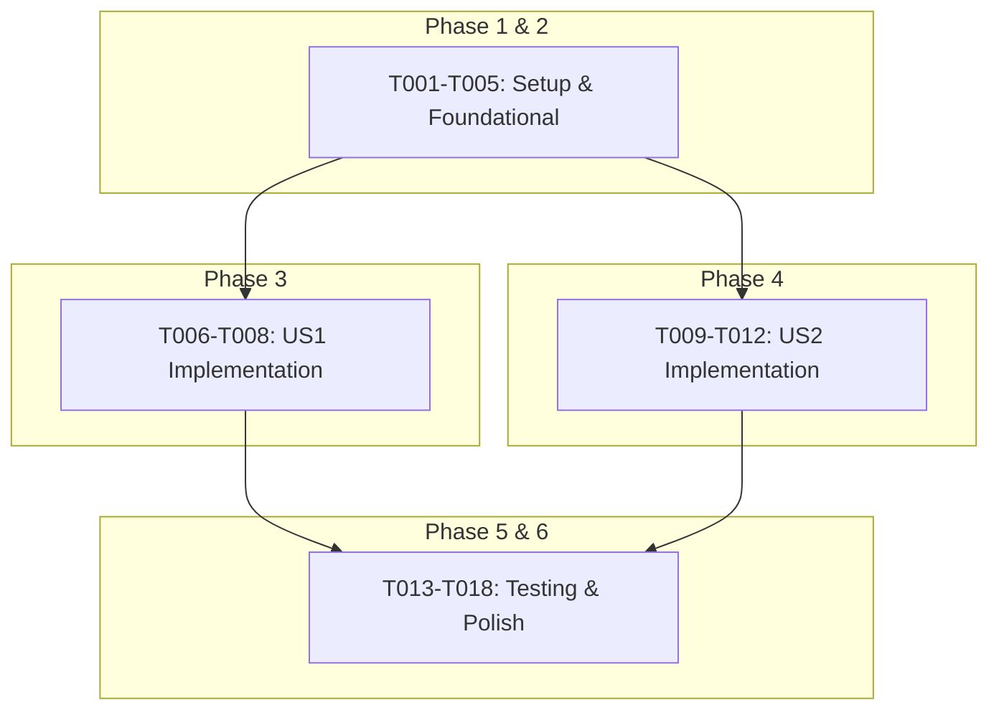

# Actionable Tasks: AIによるクイズ選択肢の自動生成

**Branch**: `002-bedrock-quiz-options`
**Feature**: [AIによるクイズ選択肢の自動生成](./spec.md)

## Implementation Strategy

本機能の実装は、ユーザー価値が最も高い「正常系の実装」をMVP（Minimum Viable Product）とし、その後フォールバック処理を追加する段階的なアプローチを取ります。各ユーザーストーリーは独立してテスト可能です。

- **MVP Scope**: ユーザーストーリー1（正常系）の実装。
- **Post-MVP**: ユーザーストーリー2（異常系・フォールバック）の実装。

## Phase 1: Setup

プロジェクトの基本的な設定と依存関係の解決を行います。

- [X] T001 `boto3` ライブラリを `pyproject.toml` の依存関係に追加する
- [X] T002 `uv pip install -r requirements.txt` を実行して依存関係を更新する

## Phase 2: Foundational

機能の核となる、外部サービスとの連携部分を実装します。これは後続のすべてのタスクの前提となります。

- [X] T003 Bedrock APIと通信するためのクライアントモジュールを `src/bedrock_client.py` に作成する
- [X] T004 `research.md` の決定事項に基づき、Boto3クライアントのリージョン、タイムアウト、リトライ設定を `src/bedrock_client.py` 内に実装する
- [X] T005 IAMロールとローカル開発用の環境変数の両方に対応できる認証処理を `src/bedrock_client.py` に実装する

## Phase 3: User Story 1 - クイズ挑戦者が紛らわしい選択肢に挑戦する

**Goal**: ユーザーがクイズの問題を開いた際に、AIが生成した不正解の選択肢が正常に表示される。

**Independent Test Criteria**:
- `/quiz/{city_id}` エンドポイントにリクエストを送信した際、レスポンスJSONの `options` 配列に4つの選択肢が含まれている。
- 選択肢の中に、正解の都市名が含まれている。
- Bedrockクライアントの `generate_options` メソッドが呼び出されていることをモックで確認できる。

### Implementation Tasks

- [X] T006 [US1] `src/main.py` の `/quiz/{city_id}` エンドポイントで、`bedrock_client` をインポートし、インスタンス化する
- [X] T007 [US1] 正解の都市名を引数として、`bedrock_client.generate_options` メソッドを呼び出し、不正解の選択肢を3つ取得するロジックを `src/main.py` に追加する
- [X] T008 [US1] 取得した不正解の選択肢と正解の選択肢を結合し、ランダムにシャッフルしてレスポンスとして返すように `src/main.py` を修正する

## Phase 4: User Story 2 - 外部サービス障害時もクイズが継続できる

**Goal**: Bedrock APIの呼び出しに失敗した場合でも、クイズが中断されることなく、ダミーの選択肢が表示される。

**Independent Test Criteria**:
- Bedrockクライアントの `generate_options` メソッドが `ClientError` を送出するようにモックを設定する。
- `/quiz/{city_id}` エンドポイントにリクエストを送信した際、HTTPステータスコード200が返却される。
- レスポンスJSONの `options` 配列に、事前に定義されたダミーの選択肢が含まれている。

### Implementation Tasks

- [X] T009 [US2] `src/bedrock_client.py` のAPI呼び出し部分に `try...except ClientError` ブロックを追加する
- [X] T010 [US2] `ClientError` が発生した場合に、カスタム例外（例: `BedrockConnectionError`）を送出するように `src/bedrock_client.py` を修正する
- [X] T011 [US2] `src/main.py` のBedrockクライアント呼び出し部分を `try...except BedrockConnectionError` ブロックで囲む
- [X] T012 [US2] 例外が発生した場合、静的に定義されたダミーの選択肢をレスポンスとして返すフォールバック処理を `src/main.py` に実装する

## Phase 5: Testing

実装されたロジックの品質を担保するための単体テストを作成します。

- [X] T013 [P] Bedrock APIが正常に選択肢を返す場合の `bedrock_client` の単体テストを `tests/test_bedrock_client.py` に作成する (boto3の`Stubber`を使用)
- [X] T014 [P] Bedrock APIが `ClientError` を返す場合の `bedrock_client` の単体テストを `tests/test_bedrock_client.py` に作成する
- [X] T015 [P] [US1] `/quiz/{city_id}` エンドポイントの正常系テスト（Bedrockクライアントをモック化）を `tests/test_main.py` に追加する
- [X] T016 [P] [US2] `/quiz/{city_id}` エンドポイントの異常系・フォールバックテスト（Bedrockクライアントをモック化）を `tests/test_main.py` に追加する

## Phase 6: Polish & Cross-Cutting Concerns

最終的なコードの品質向上とドキュメントの更新を行います。

- [ ] T017 [P] `src` ディレクトリ全体に対して `ruff` フォーマッタを適用する
- [X] T018 [P] `README.md` に、ローカル開発時のAWS認証情報設定に関する説明を追記する

## Dependencies

## Parallel Execution

- **Phase 5 (Testing)** のタスク (T013 - T016) は、それぞれ独立しているため並行して実装可能です。
- **Phase 6 (Polish)** のタスク (T017, T018) も並行して実施可能です。
